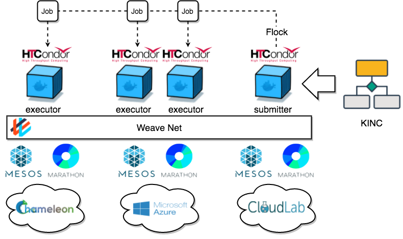

Running KINC Workflow on Containerized HTCondor Pools across Clouds
===================================================================
In this tutorial, we run the KINC workflow in containerized
[HTCondor](https://research.cs.wisc.edu/htcondor/) pools distributed
across multiple Cloud platforms, using a combination of technologies
including [Docker](https://www.docker.com/),
[Apache Mesos](http://mesos.apache.org/),
[Marathon](https://mesosphere.github.io/marathon)
and [Weave Net](https://www.weave.works/oss/net).
We have successfully run the workflow across
[Chameleon](https://www.chameleoncloud.org/),
[Azure](azure.microsoft.com) and [CloudLab](https://cloudlab.us/).

## Overview



The system is built on top of VMs or bare-metal machines (referred to
as *hosts*) provisioned by different Cloud platforms. On each Cloud,
Apache Mesos is deployed for managing resources (*e.g.,* CPU, memory,
disk) available on the *hosts* in clusters. These resources are utilized
by containerized applications in an on-demand fashion. Marathon is
deployed on top of each Mesos cluster, accepting reqeusts for deploying
containerized applications on the Mesos cluster.

To enable communication among containers across Cloud platforms, we use
Weave Net to create a virtual network among the containers. Weave Net
works in a purely decentralized fashion. Each *host* joins the network
as a peer and the Weave Net daemon on each *host* coordinates with each
other to route traffic among containers on different *hosts*. It also
supports advanced network management. For more details, please refer to
[this link](https://www.weave.works/docs/net/latest/overview/).

To allow flexible deployment of HTCondor pools, we have containerized
HTCondor pool using Docker. Each container runs as an independent,
all-in-one HTCondor pool. We rely on the HTCondor's
[flocking mode](https://research.cs.wisc.edu/htcondor/manual/v7.8/5_2Connecting_HTCondor.html)
to collectively utilize these distributed, containerized
HTCondor pools. Jobs are submitted to the *submitter* pool and flocked
to *executor* pools for execution. Specifically, for the KINC workflow,
the *submitter* flocks workflow jobs to the *executors* in a FCFS
fashion.


## Quick Start

#### 1. Subscribe Resources

Subscribe VMs or bare-metal machines from Cloud platforms and get their
**public IP addresses**. **Note: as of writing, the code only supports
Ubuntu 14 and 16**.

#### 2. Setup
Launch `setup.sh` on each *host* to install required software. The
script deploys a minimal Marathon/Mesos cluster on a single *host*. The
usage is listed as below:

```
  Usage: ./setup.sh -h <master-public-ip> [-p <peer-list>] [-n <num-cores>]
  
  Install Docker, Mesos and Marathon on Ubuntu server

  Options:
      -h <master-ip-addr>: public IP address of the Mesos master
      -p <peer-list>: a comma-separated list of public IP addresses of peer hosts
      -n <num-cores>: number of cores for compiling Mesos source code
      
  Note:  Installation paths will be off if you are not in the home directory when running setup.sh. Please do the following:
  
  $ cd; git clone https://github.com/SciDAS/htcondor-docker-centos
  $ cd; htcondor-docker-centos/docker-kinc/setup.sh -h <MASTER_FLOATING_IP> -p <OTHER_NODE_FLOATING_IP> -n <num-cores>
```

To run docker commands without `sudo`, run the following command and then
log out and log back in on each *host*:

```
$ sudo usermod -aG docker $USER
```


A peer is a *host* that offers resources for running
containerized applications. Peers listed after `-p` option will be
connected to each other by Weave Net to build the virtual network for
containers, so that containers running on these peers can communicate
with each other over the virtual network. Option `-p` is **optional**,
as peers can be added to or removed from the network later on.

To add a new peer:

```bash
# on the new peer
$ sudo weave launch

# on the existing peers
$ sudo weave connect $NEW_PEER_IP
```

To remove a peer:

```bash
# on all the peers
$ sudo weave forget $PEER_TO_REMOVE_IP
```

The `-n` option specifies the level of parallelism for compiling Mesos
source code. It is **optional** and defaults to 4.

#### 3. Create Containers
Script `workflow/create_containers.py` can be used to create containers
across multiple Marathon/Mesos clusters. The usage is listed as below:

```
usage: create_containers.py [-h] [-c CONFIG]

Submit KINC workflow to distributed Mesos clusters

optional arguments:
  -h, --help            show this help message and exit
  -c CONFIG, --config CONFIG
                        path to JSON configuration file
```

The script reads a JSON configuration file to submit container requests
to Marathon/Mesos clusters. An example of the JSON configuration file is
listed below:

```json
{
  "clusters": [
    {
        "id": "chameleon",
        "marathon_uri": "http://130.202.88.187:8080/v2/apps"
    },
    {
        "id": "azure",
        "marathon_uri": "http://40.71.41.241:8080/v2/apps"
    }
  ],
  "containers": [
    {
      "id": "submitter",
      "cluster": "chameleon",
      "image": "scidas/kinc-submitter",
      "n_cpus": 1,
      "mem": 2048,
      "disk": 50000,
      "ip_addr": "170.20.85.100",
      "args": []
    },
    {
      "id": "runner1",
      "cluster": "chameleon",
      "image": "scidas/htcondor-worker-centos7",
      "n_cpus": 12,
      "mem": 4096,
      "disk": 50000,
      "ip_addr": "170.20.85.101",
      "args": ["12"]
    },
    {
      "id": "runner2",
      "cluster": "azure",
      "image": "scidas/htcondor-worker-centos7",
      "n_cpus": 8,
      "mem": 4096,
      "disk": 50000,
      "ip_addr": "170.20.85.102",
      "args": ["8"]
    }
  ]
}
```
Please note that the OSG-KINC workflow will require 1 GB of RAM per job.  The memory allocated to each job will be equal to the mem requested in the config.json file divided by the number of cpus requested.  Here is an example of a sufficient allocation for a chemeleon worker site:

```json
    {
      "id": "runner1",
      "cluster": "chameleon",
      "image": "scidas/htcondor-worker-centos7",
      "n_cpus": 12,
      "mem": 120000,
      "disk": 100000,
      "ip_addr": "170.20.85.101",
      "args": ["12"]
    }
```

#### 4. Run KINC Workflow
The KINC workflow has been baked into the docker container
`scidas/kinc-submitter`. To run the workflow, kick off the
`/home/condor_pool/OSG-KINC/submit` on behalf of user `condor_pool` as
shown below:

```bash
# on the host where the submitter container is running
$ docker exec -ti \
    -u condor_pool \
    -e USER=condor_pool \
    $SUBMITTER_CONTAINER_ID \
    /bin/bash -c \
    "source /etc/profile; cd /home/condor_pool/OSG-KINC/; ./submit 1000"
```

Alternatively, you can run `workflow/run_kinc.py` on the host where
the *submitter* container is running to submit and monitor the KINC
workflows automatically.

```
$ ./workflow/run_kinc.py
```

To check whether jobs are flocked to *executors*, log in the *host*
with the *executors* running and run `condor_status`.

```
# on the host where the executors are running
$ docker exec -ti $EXECUTOR_CONTAINER_ID /usr/bin/condor_status
```


## Troubleshooting


